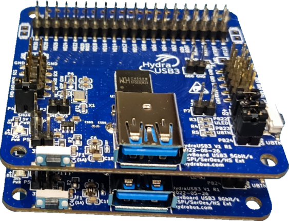

# HydraUSB3 v1 Test firmware / examples / libraries(drivers)
hydrausb3_fw repository contains open source (see [LICENSE](LICENSE)) test firmware / examples / libraries(drivers)(see [peripheral](SRC/Peripheral/)) for HydraUSB3 board using WCH CH569W MCU.
* Contributor shall check [CODING_STYLE.md](CODING_STYLE.md)

For more details on HydraUSB3 see https://hydrabus.com/hydrausb3-v1-0-specifications

All examples with name HydraUSB3_DualBoard_XXX requires 2x HydraUSB3 v1 boards to be plugged together.
* First HydraUSB3 board shall have PB24 not populated (called RX mode)
* Seconds HydraUSB3 board shall have PB24 populated with a 2.54mm Jumper (called TX mode)

[SRC](SRC/) directory contains [Startup](SRC/Startup/) / [Linker Script](SRC/Ld/) / [RVMSIS](SRC/RVMSIS/) / [Peripherals code](SRC/Peripheral/) based on WCH official code from https://github.com/openwch/ch569/tree/main/EVT/EXAM/SRC (but heavily refactored/rewritten on lot of parts)

### How to build the firmware source code for HydraUSB3(CH569 MCU) with MounRiver Studio(Eclipse based) IDE
It is recommended to use MounRiver Studio "Embedded RISC-V IDE" or "RISC-V IDE (Community)" to build the source code 
* See http://www.mounriver.com/download
* Windows 10 x64 + MounRiver Studio V181 tested with success
* Windows 10 x64 + MounRiver Studio Community Win V120 tested with success
* Linux Ubuntu 20.04 LTS x64(Ubuntu 20.04 LTS or any Debian-Based Linux distribution shall work the same)
  * MounRiver_Studio_Community_Linux_x64_V120(RISC-V IDE Community) tested with success
  * MRS_Toolchain_Linux_x64_V1.50(Toolchain&Debugger) tested with success

#### Import examples project(s) in MounRiver Studio (it is based on Eclipse IDE)
* Launch MounRiver Studio (any version MounRiver Studio V181 or MounRiver Studio Community V120 the interface is the same)
  * Select a directory workspace (use the default one)
  * Select Menu `File` => `Import...`
    * In Import Windows choose `General` => `Existing Projects into Workspace`
      * Select `Next >`
      * A window `Import Projects` appears
        * Click on  `Browse` near "Select root directory:" and choose hydrausb3_fw directory
          * Click on `Select Folder`
        * Select the different project(s) you want to import (in `Projects`)
        * Click on `Finish`
  * Project Explorer now show all imported projects
    * Left Click on any project (or choose multiple projects too) to highlight them
    * Right click on the highlighted project and choose `Build Project` or `Build Projects`
    * If all is ok the project shall build fine and display in `Console` "Build Finished. 0 errors, 0 warnings."

### How to build the firmware source code for HydraUSB3(CH569 MCU) with shell
#### Windows 10 x64 + MounRiver Studio V181 / MounRiver Studio Community Win V120 with [MSYS2/MINGW64](https://www.msys2.org/)
* Install [MSYS2/MINGW64](https://www.msys2.org/)
  * Follow all the steps including "Now MSYS2 is ready for you. You will probably want to install some tools and the mingw-w64 GCC to start compiling:" 
    * `pacman -S --needed base-devel mingw-w64-x86_64-toolchain`
* Start mingw64
* Add the path to "RISC-V Embedded GCC" bin directory
  * For MounRiver Studio V181
    * `PATH="/c/MounRiver/MounRiver_Studio/toolchain/RISC-V Embedded GCC/bin/":$PATH`
  * For MounRiver Studio Community Win V120
    * `PATH="/c/MounRiver/MRS_Community/toolchain/RISC-V Embedded GCC/bin/":$PATH`
* Prerequisites
  * Install git
    * `pacman -S git`
  * Clone `hydrausb3_fw` repository with git
    * `cd ~`
    * `git clone --recursive https://github.com/hydrausb3/hydrausb3_fw.git`
* Change current directory to firmware example (here HydraUSB3_Blink_ULED)
  * `cd ~/hydrausb3_fw/HydraUSB3_Blink_ULED`
* Clean and build the firmware example
  * `make clean all`
* The flashable firmware with `wch-isp` (*.bin) is available in `~/hydrausb3_fw/HydraUSB3_Blink_ULED/build/HydraUSB3_Blink_ULED.bin`

#### Linux + MounRiver_Studio_Community_Linux_x64_V120(RISC-V IDE Community)
* Linux (Ubuntu 20.04 LTS or any Debian-Based Linux distribution shall work the same)
* Download [MounRiver_Studio_Community_Linux_x64_V120.tar.xz](http://file.mounriver.com/upgrade/MounRiver_Studio_Community_Linux_x64_V120.tar.xz)
  * Extract the archive and install it like described in the README
* Start a Terminal emulator
* Add the path to "RISC-V Embedded GCC" bin directory
  * `PATH=$PATH:~/MounRiver_Studio_Community_Linux_x64_V120/MRS_Community/toolchain/RISC-V\ Embedded\ GCC/bin`
* Prerequisites
  * Install git
    * `sudo apt install git`
  * Clone `hydrausb3_fw` repository with git
    * `cd ~`
    * `git clone --recursive https://github.com/hydrausb3/hydrausb3_fw.git`
* Change current directory to firmware example (here HydraUSB3_Blink_ULED)
  * `cd ~/hydrausb3_fw/HydraUSB3_Blink_ULED`
* Clean and build the firmware example
  * `make clean all`
* The flashable firmware with `wch-isp` (*.bin) is available in `~/hydrausb3_fw/HydraUSB3_Blink_ULED/build/HydraUSB3_Blink_ULED.bin`

#### Linux + MRS_Toolchain_Linux_x64_V1.50(Toolchain&Debugger)
* Linux (Ubuntu 20.04 LTS or any Debian-Based Linux distribution shall work the same)
* Download [MRS_Toolchain_Linux_x64_V1.50.tar.xz](http://file.mounriver.com/tools/MRS_Toolchain_Linux_x64_V1.50.tar.xz)
  * Extract the archive and install it like described in the README
* Start a Terminal emulator
* Add the path to "RISC-V Embedded GCC" bin directory
  * `PATH=$PATH:~/MRS_Toolchain_Linux_x64_V1.50/RISC-V\ Embedded\ GCC/bin`
* Prerequisites
  * Install git
    * `sudo apt install git`
  * Clone `hydrausb3_fw` repository with git
    * `cd ~`
    * `git clone --recursive https://github.com/hydrausb3/hydrausb3_fw.git`
* Change current directory to firmware example (here HydraUSB3_Blink_ULED)
  * `cd ~/hydrausb3_fw/HydraUSB3_Blink_ULED`
* Clean and build the firmware example
  * `make clean all`
* The flashable firmware with `wch-isp` (*.bin) is available in `~/hydrausb3_fw/HydraUSB3_Blink_ULED/build/HydraUSB3_Blink_ULED.bin`

### How to flash the firmware for HydraUSB3(CH569 MCU) with In-system programming(ISP) tool(over USB)
#### Windows with MounRiver Studio IDE
* Windows 10 x64 + MounRiver Studio V181 execute menu Tools => WCH In-System Programmer
  * See also https://github.com/hydrausb3/wch-isp
* Windows 10 x64 + MounRiver Studio Community Win V120 does not include WCHISPTool / wch-isp so it shall be downloaded and installed
  * See https://github.com/hydrausb3/wch-isp
     * It is the recommended to use the open source multiplatform(Linux&Windows) command line tool wch-isp to flash the HydraUSB3 CH569W chipset
  	 * Example usage: wch-isp.exe -vr flash fullpath/file.bin
  	 * Example usage with HydraUSB3_Blink_ULED with MSYS2/MINGW64: 
	   * `./wch-isp -vr flash ~/hydrausb3_fw/HydraUSB3_Blink_ULED/build/HydraUSB3_Blink_ULED.bin`	 
  * See alternative application https://www.wch.cn/downloads/WCHISPTool_Setup_exe.html

#### Linux x64 (Ubuntu 20.04 LTS or any Debian-Based Linux distribution shall work the same)
* MounRiver Studio Community Linux V120 x64 or MRS_Toolchain_Linux_x64_V1.50 does not include WCHISPTool / wch-isp so it shall be downloaded/built and installed
  * See https://github.com/hydrausb3/wch-isp
     * It is the recommended to use the open source multiplatform(Linux&Windows) command line tool wch-isp to flash the HydraUSB3 CH569W chipset
  	 * Example usage: ./wch-isp -vr flash fullpath/file.bin 
  	 * Example usage with HydraUSB3_Blink_ULED: 
	   * `./wch-isp -vr flash ~/hydrausb3_fw/HydraUSB3_Blink_ULED/build/HydraUSB3_Blink_ULED.bin`
